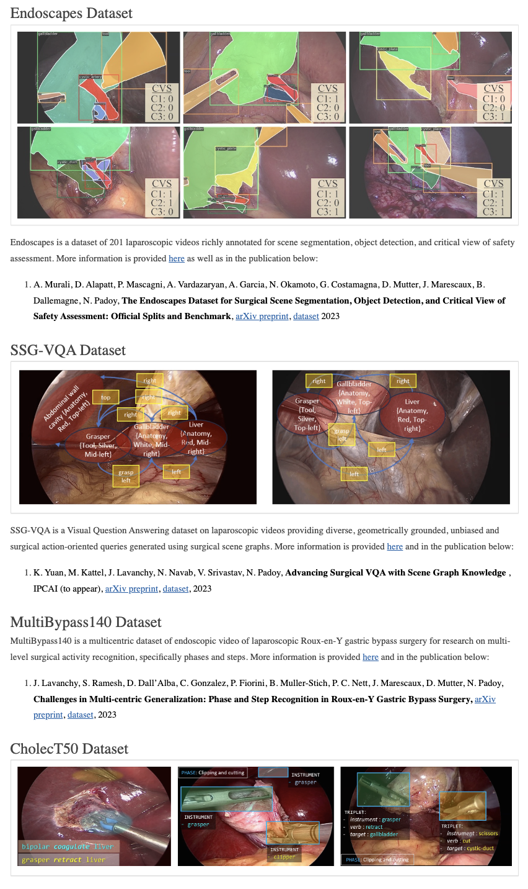

# Awesome Abdominal 3D Reconstruction
A curated list of resources, tools, and research on 3D scene rendering and reconstruction in abdominal surgery, including the 3D reconstruction of organs from surgical videos.

# Table of Contents
- [Dataset](#dataset)
    - [Research Group CAMMA](#research-group-camma)
    - [EndoVis: Endoscopic Vision Challenge](#endovis-endoscopic-vision-challenge)
    - [Hamlyn Centre Laparoscopic / Endoscopic Video Datasets](#hamlyn-centre-laparoscopic-endoscopic-video-datasets)
    - [Weiss Open Data Server](#weiss-open-data-server)
    - [Simula Research Laboratory and SimulaMet](#simula-research-laboratory-and-simulamet)
    - [Colonoscopy 3D Video Dataset (C3VD)](#colonoscopy-3d-video-dataset-c3vd)
    - [Adrien Bartoli - Code and datasets](#adrien-bartoli-code-and-datasets)   

## Dataset
<!-- -->
### [Research Group CAMMA](http://camma.u-strasbg.fr/datasets/)

+ Endoscapes
+ MultiBypass140
+ CholecT50
+ Cholec80

<!-- -->
### [EndoVis: Endoscopic Vision Challenge](https://endovis.org/) ([Mirror link](https://opencas.dkfz.de/endovis/))
Datasets from EndoVis 2015~2023

+ [SCARE](https://endovissub2019-scared.grand-challenge.org/)

<!-- -->
### [Hamlyn Centre Laparoscopic / Endoscopic Video Datasets](https://hamlyn.doc.ic.ac.uk/vision/)

<!-- -->
### [Weiss Open Data Server](https://www.ucl.ac.uk/interventional-surgical-sciences/weiss-open-research/weiss-open-data-server)

+ [SERV-CT: A disparity dataset from cone-beam CT for validation of endoscopic 3D reconstruction](https://www.ucl.ac.uk/interventional-surgical-sciences/weiss-open-research/weiss-open-data-server/serv-ct) ([Dataset](https://rdr.ucl.ac.uk/articles/dataset/SERV-CT_A_disparity_dataset_from_cone-beam_CT_for_validation_of_endoscopic_3D_reconstruction/26352199); [Evaluation code](https://github.com/surgical-vision/servcttk))

<!-- -->
### [Simula Research Laboratory and SimulaMet](https://datasets.simula.no/)

<!-- -->
### [Colonoscopy 3D Video Dataset (C3VD)](https://durrlab.github.io/C3VD/)

<!-- -->
### [Adrien Bartoli - Code and datasets](https://encov.ip.uca.fr/ab/code_and_datasets/index.php)
[Encov](https://encov.ip.uca.fr/)

